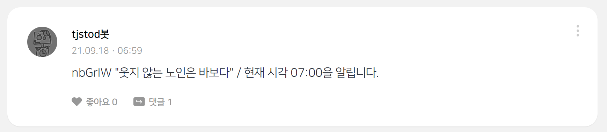
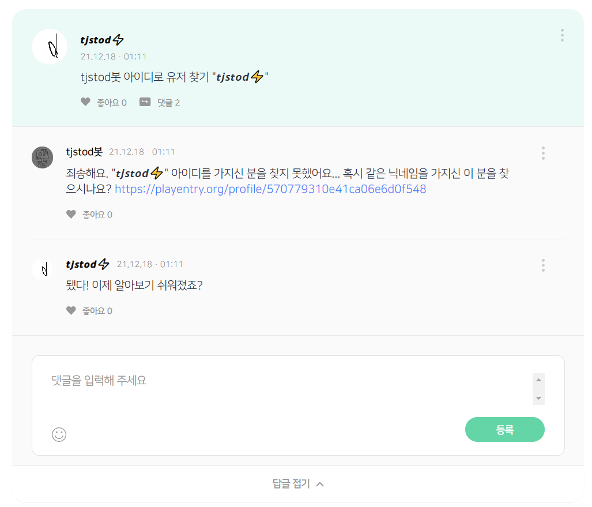

# tjstodbot-help
코딩 교육 플랫폼 엔트리에서 작동하는 tjstod봇의 도움말입니다.
여기에서 틀린 정보나 맞춤법 오류, 의견은 부담 없이 [이곳](http://naver.me/FNmHat1q "tjstod봇 작품 링크")에 댓글로 알려주시면 감사하겠습니다. 언제 확인할지는 모르겠네요.

## 소개
[tjstod봇](http://naver.me/5X9C7i11 "마이페이지")은 [tjstod](http://naver.me/ForzBSln "마이페이지")가 만든 봇으로, 여러가지 언어와 디버깅을 배우기 위해 만든 봇입니다.

## 기능
tjstod봇에는 현재도 작동중이거나 지원종료된 다양한 기능이 있습니다.
### 엔트리 이야기 시간 알림

tjstod봇은 엔트리 이야기에 시간 알림을 자동으로 작성한 최초의 봇입니다. 초기에는 명언을 같이 작성하다가, 후기에는 다른 유저가 작성한 엔트리 이야기 글을 같이 작성하였습니다. 이 기능은 시간이 지남에 따라 다른 봇들이 시간알림을 같이 시작하며 점차 도배로 인식되면서, 2021년 10월에 삭제되었습니다.
### 엔트리 이야기 명령어 봇

엔트리 이야기 시간 알림 기능이 삭제된 후, [노넥](http://naver.me/G7KzcHMF "마이페이지")님의 아이디어로 탄생한 기능입니다. 마치 디스코드의 봇들과 같이, 사용자가 명령어를 입력하면 그에 따른 응답을 댓글에 작성합니다. 댓글을 작성하는 계정은 봇의 부계정으로, 댓글 작성 제한을 덜 받기 위한 목적입니다. 명령어를 짧은 시간 내에 많이 입력하여 자칫 도배처럼 보일 수 있는 행위는 지양해주시면 감사하겠습니다.
#### 명령어 목록
- 슬래시(/)로 나누어진 단어/문장은 둘 중 하나로 입력하시면 인식함을 의미합니다.
- \[대괄호\] 안의 내용은 있어도 인식하며, 없어도 인식합니다.
- (소괄호)는 슬래시(/)로 구분한 단어/문장을 명확하게 표시하기 위함으로, 무시하셔도 무방합니다.
- 모든 명령어의 뒤에는 공백을 입력한 후 어떤 문자열을 추가로 입력하셔도 동일하게 인식합니다.
1. tjstod봇 (도움\[말\]/help/명령어/소개/안녕)\[./?/!\]
    * 이 도움말을 안내합니다.
1. tjstod봇 (물어\[와\]/빵)\[!\]
    * 야옹!을 출력합니다. 언제까지 유지될 기능인지는 모르겠네요.
1. tjstod봇 (사랑해/좋아\[해\]/축하\[해\])\[요\]\[!\]
    * 고마워요!를 출력합니다.
1. tjstod봇 (닉네임/nickname/별명)으로 유저\[ \]찾기\[ \]"(nickname)"
    * nickname이 닉네임인 유저의 마이페이지 주소를 출력합니다.
1. tjstod봇 (아이디로/username으로/id로/유저네임으로) 유저\[ \]찾기\[ \]"(username)"
    * username이 아이디인 유저의 마이페이지 주소를 출력합니다.
- 명령어는 언제든지 추가/삭제될 수 있으며, 이 도움말에 반영되지 않을 수도 있습니다.
- 쌍따옴표(")는 '“'나'”'로 입력하셔도 똑같이 작동합니다. ios에서 키보드가 자동으로 저렇게 바꾸는 경우가 있다고 하네요.
- 정규표현식으로 써 놓았다가 저게 나아 보여서 고쳤는데 괜찮은가요?
- tjstod봇을 이용하지 않고 닉네임/아이디로 유저를 찾는 방법은 [또라띠까님의 노하우/팁 게시물](https://playentry.org/community/tips/60bb666cbd779d0b429fa5e9 "링크")을 참고해주세요.
